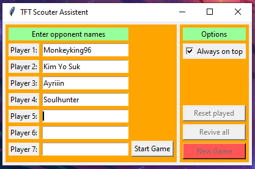

TFT Scout Assist
================

A small python tkinter app for the game Teamfight Tactics from Riot Games to help track who the next possible opponents are.

## Table of Contents
1. [Features and Usage](#features)
	1. [Game setup](#setup)
	2. [Game controls](#controls)
2. [Installation](#installation)

## Features and Usage

### Game setup:
1. In the first screen enter the names (or any identifier you want, like a shorthand for the name) of your 7 opponents.
2. Click `Start Game`.

### Game controls:
- The `left column` will alway contain the opponents you can possibly play against next. The `right column` contains the players you last played against (in the correct order).
- Click on a player name in the left column to mark them as `played against`.

- If a player is eliminated, press the red cross button next to it's name. The button of that player will be removed.

- With the checkbutton `Always on top` toggled, the App will always appear n top of every other window including the game.
- The size of the window makes it a perfect fit for the bottom right corner in the game (tested on a 1920x1080 pixel monitor).

- Click `Reset played` to move all not eliminated opponents back to the left column.
- Click `Revive all` to bring back all buttons of opponents that you previously marked as eliminated. *This will also move all buttons back to the left column!*
- Click `New Game` to delete all players and return to the first screen where you can enter the opponent's names for the next game.

## Installation

1. Download this script  [here](https://github.com/Kahitar/TFTScoutAssist/archive/master.zip) (Or by clicking "Code" -> "Download ZIP" on the right above the file list).
2. Unzip to any folder you like.
3. Install python using the Microsoft Store (Windows 10): [Link](https://www.microsoft.com/store/productId/9NJ46SX7X90P)
	- I didn't test this App on Apple OS and have no idea if it works there and how to install python. If you have success using it there, feel free to tell me how and I'll add instructions here.
4. Just douple-click the tft_scouter.py file. If python is installed correctly, the App should open (don't close the command window that appears, as that would close the App).
